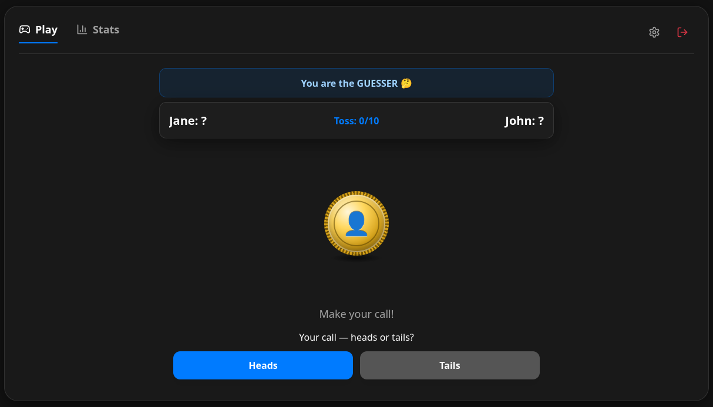
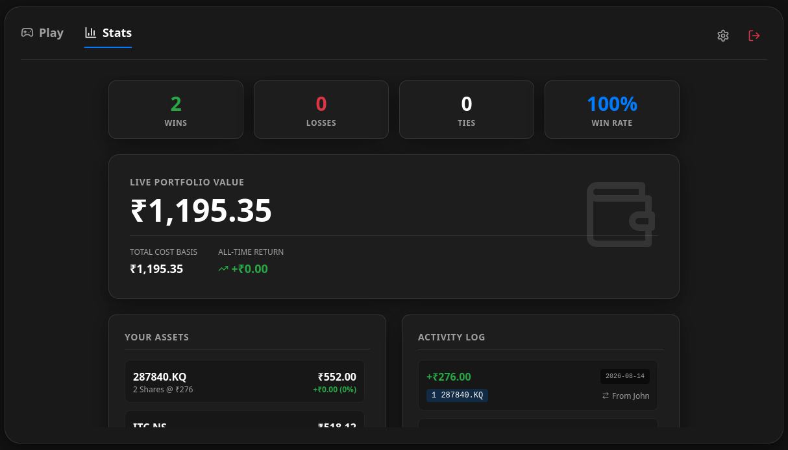

 # Fair Coin Flip & Portfolio Tracker

> A modern, real-time multiplayer full-stack application that transforms a classic coin-flip game into a simulated fintech portfolio tracker using live market data.

---

## 🚀 Overview

**Fair Coin Flip** is an interactive web application designed for friends to compete in real-time coin toss matches. Losers settle their bets by gifting fractional shares of real stocks (via live **Yahoo Finance** tracking), which populate a dynamic, robinhood-style executive portfolio dashboard displaying real-time Profit & Loss (P&L) and historical activity ledgers.

---

## 🛠️ Tech Stack

* **Frontend**: React, Vite, Tailwind CSS, Lucide Icons
* **Backend**: Python, FastAPI, WebSockets
* **Database**: SQLite (persisted via Docker Named Volumes)
* **Deployment**: Docker, Docker Compose, Cloudflare Tunnel

---

## ✨ Key Features

* **Real-Time Multiplayer**: Instant WebSocket synchronization enabling cross-device gameplay (play against a friend from separate phones or laptops).
* **Live Stock Integration**: Real-time ticker autocomplete search powered by the public Yahoo Finance API to lock in transaction cost bases.
* **Executive Fintech Dashboard**: Live net worth calculations, P&L tracking, responsive asset ledgers, and secure account management (including password updates).
* **Production-Ready Deployment**: Fully containerized and exposed securely to the internet via an automated Cloudflare Tunnel without local port-forwarding hassles.

---

## 📸 Screenshots

### 1. Active Game Room

*(Features real-time 3D coin animations, dynamic role assignments, and live score tracking)*



### 2. Executive Portfolio Dashboard

*(Features live market sync, asset holdings ledger, and win-rate analytics)*



---

## ⚙️ Local Development & Deployment

### Prerequisites

* Docker & Docker Compose installed on your host machine / VPS.

### Quick Start

1. Clone the repository and navigate to the project root.
2. Spin up the container stack using Docker Compose:
```bash
docker compose up --build -d

```


3. View the container logs to access your secure Cloudflare Tunnel URL:
```bash
docker compose logs tunnel

```


4. Open the generated public URL in your browser to start playing!

---

## 🛡️ GNU AGPLv3 License

This project is licensed under the **GNU Affero General Public License v3.0 (AGPL-3.0)**.
